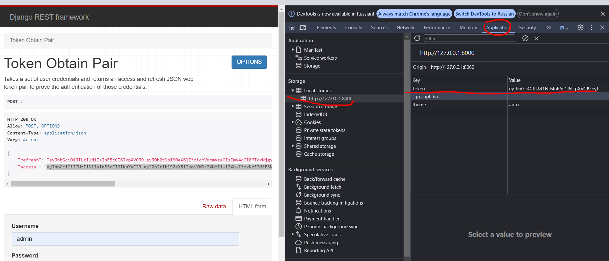

# WebSocket Comments

This project is implemented on Django DRF using Web Sockets to display comments in real time
[Comments project deployed on Render](https://comments-3g0k.onrender.com)

## Features

- JWT authentication
- Real time comments
- Files validation
- CAPTCHA
- Managing media files using S3

## Tech Stack

**Core**:
- Django
- Django REST Framework (DRF)
- djangochannelsrestframework
- Channels
- Redis
- Web Sockets
- S3
***
**DataBase**: PostgreSQL
***
**Containerization platform:** Docker

## How to run

```
git clone https://github.com/mdubyna/Comments.git
cd  Comments
python -m venv venv
.\venv\Scripts\activate
pip install -r requirements.txt 
```
- Create new Postgres DB & User
-  .env.sample -> .env
- Replace 
```const socket = new WebSocket(`wss://${window.location.host}/ws/comments/?token=${token}`);```
to ```const socket = new WebSocket(`ws://${window.location.host}/ws/comments/?token=${token}`);```
 in templates/comments/index.html
```
python manage.py migrate
daphne -b 0.0.0.0 -p 8000 comments_app.asgi:application
```


## Run with docker

- Docker should be installed
- Docker compose should be installed
- Replace 
```const socket = new WebSocket(`wss://${window.location.host}/ws/comments/?token=${token}`);```
to ```const socket = new WebSocket(`ws://${window.location.host}/ws/comments/?token=${token}`);```
 in templates/comments/index.html
```
Copy .env.sample -> .env
docker-compose build
docker-compose up
```

## How to test web socket

- Go to ```register/``` endpoint and register
- Go to home page ```http://127.0.0.1:8000/``` login and take access token
- Put token to local storage with key "Token"

- Go to ```comments/``` endpoint
